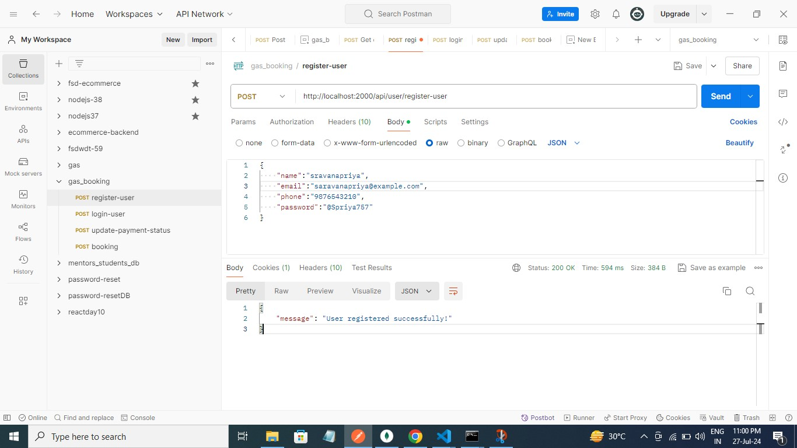
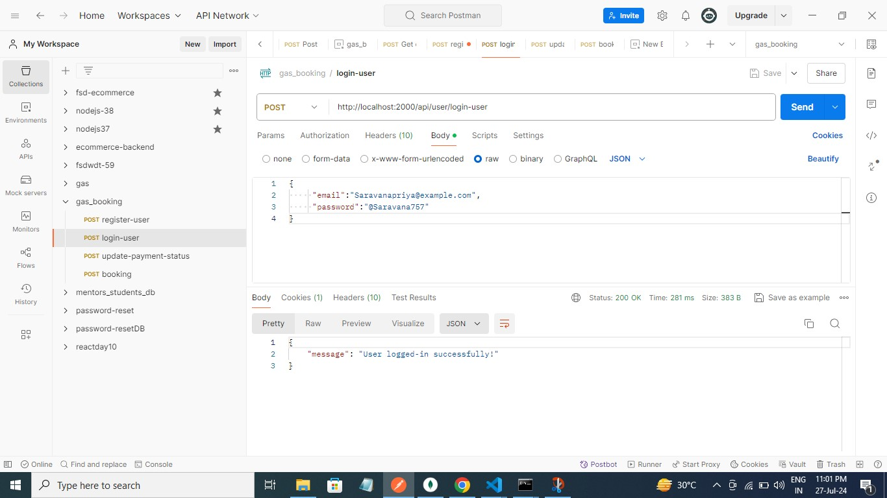

## TITLE

**gas slot booking app**

## Description:

Design and develop an Application using the full-stack.

## Procedure:

step1: Open file manager then select project name [fsd-gas-slot-bookingBE] tpye cmd then open command prompt type (code .) then create vs code.

step2: Create an empty directory

Generate a package.json file by running npm init -y or npm init

**Install the required dependencies:**

npm install express

Create an entry point file (index.js) in the root directory

step3: vs code -> to create .gitignore file and index.js, Controller, Models, Database, Routes, .env file and README.md file for the task

step4: Then i use [postman] App -> Add collection -> then create [ gas_booking ] -> Then Add Request for get my result.

step5: Then deployed for github and Render.com

